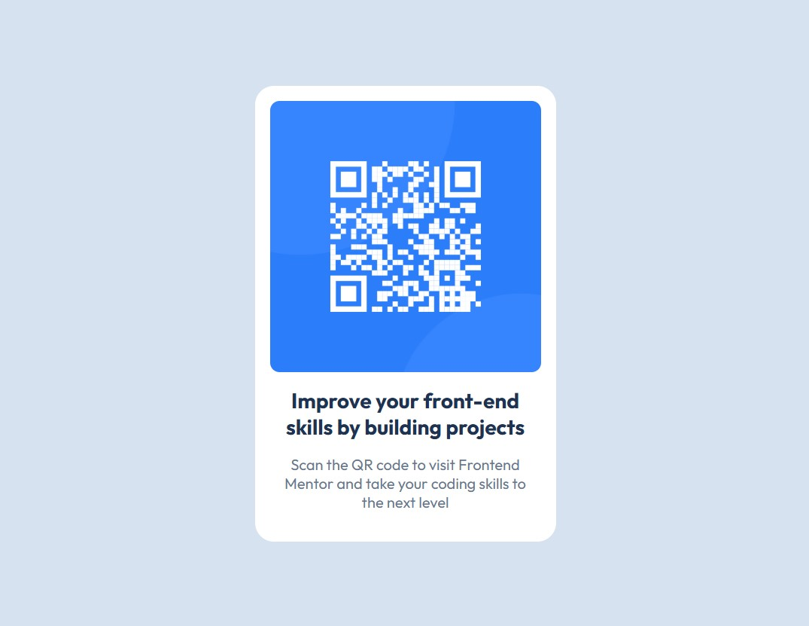

# Frontend Mentor - QR code component solution


This is a solution to the [QR code component challenge on Frontend Mentor](https://www.frontendmentor.io/challenges/qr-code-component-iux_sIO_H). Frontend Mentor challenges help you improve your coding skills by building realistic projects. 

## Table of contents

- [📝 Overview](#-overview)
  - [📸 Screenshot](#-screenshot)
  - [🔗 Links](#-links)
- [🛠️ My process](#-my-process)
  - [🧱 Built with](#-built-with)
  - [📂 Folder Structure](#-folder-structure)
  - [💡 What I learned](#-what-i-learned)
  - [🚀 Continued development](#-continued-development)
  - [📚 Useful resources](#-useful-resources)
  - [🤝 AI Collaboration](#-ai-collaboration)
- [📄 License](#-license)
- [👤 Author](#-author)
- [🙏 Acknowledgments](#-acknowledgments)


## 📝 Overview

### 📸 Screenshot



### 🔗 Links

- **Live Demo**: [View Live](https://ali-zol.github.io/qr-code-component-html-css/)
- **Repository**: [GitHub Repo](https://github.com/Ali-Zol/qr-code-component-html-css.git)

## 🛠️ My process

### 🧱 Built with

- Semantic HTML5 markup
- Modern CSS units (`svh`, `rem`, `%`) for scalable and responsive design
- Flexbox for layout and centering

### 📂 Folder Structure

```text
/
├── css/
│   └── style.css
├── images/
│   ├── favicon-32x32.png
│   └── image-qr-code.png
├── index.html
├── screenshot.jpg
├── LICENSE
└── README.md
```

### 💡 What I learned

This project was a good opportunity to solidify my foundational HTML and CSS skills. Some of the key takeaways include:

1. **Responsive Images:** I learned the importance of preventing images from overflowing their containers. Adding a global rule for images was a game-changer for responsive design.
   
    ```css
    /* Prevents images from causing horizontal scroll on small screens */
    img {
      max-width: 100%;
    }
    ```

2. **Modern Centering:** Using `min-height: 100svh` combined with Flexbox on the `body` element proved to be the most robust way to perfectly center the card both vertically and horizontally, especially on mobile devices where browser bars can affect the viewport height.

3. **Semantic HTML & Accessibility:** Using `<article>` for the card component and writing descriptive `alt` text reinforced the importance of building web pages that are meaningful to both browsers and screen readers.

4. **Clean Code Practices:** I practiced writing conventional commit messages (e.g., `feat`, `fix`, `refactor`) to maintain a clear and professional project history.

### 🚀 Continued development

I plan to focus on the following areas in my next projects:

- Using **CSS Custom Properties (Variables)** to manage colors and spacing more efficiently.
- Exploring **CSS Grid** for more complex, two-dimensional layouts.

### 📚 Useful resources

- [MDN Web Docs: box-sizing](https://developer.mozilla.org/en-US/docs/Web/CSS/Reference/Properties/box-sizing) - Helped me understand how padding affects element width.
- [MDN Web Docs: align-items](https://developer.mozilla.org/en-US/docs/Web/CSS/Reference/Properties/align-items) - Helped me examine the effect of different `align-items` values.

### 🤝 AI Collaboration

I used an AI mentor (Qwen) throughout this project, but with a specific learning-focused approach:

- **How I used it:** Instead of asking for complete code solutions, I used the AI to review my code, explain *why* certain CSS behaviors occur and guide me toward finding the right properties myself.
- **Outcome:** This collaborative approach ensured that I actually learned the underlying concepts rather than just copying and pasting code.

## 📄 License

This project is open source and available under the [MIT License](LICENSE).

## 👤 Author

- Ali-Zol - [GitHub](https://github.com/Ali-Zol)
- Frontend Mentor - [@Ali-Zol](https://www.frontendmentor.io/profile/Ali-Zol)

## 🙏 Acknowledgments
Thanks to the Frontend Mentor community for providing such a great platform to practice real-world projects. If you have any feedback or suggestions, feel free to open an issue or reach out!